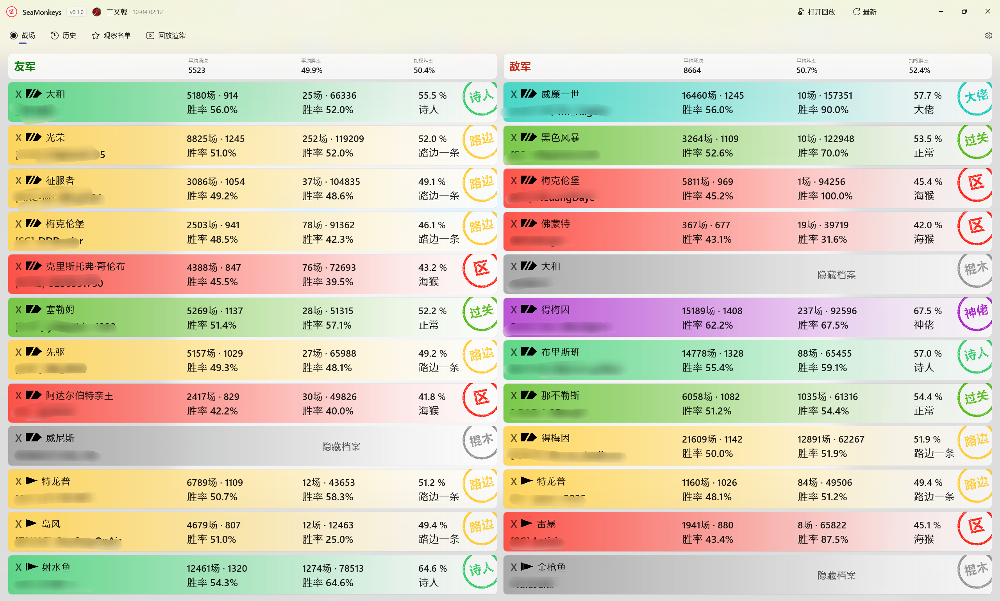
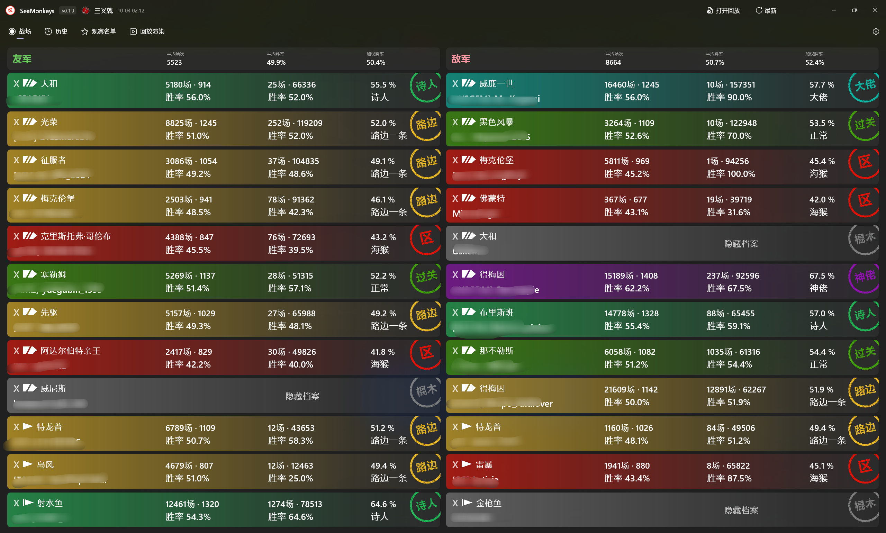

<div align="center">


# SeaMonkeys

**《战舰世界》实时战绩助手**

读取游戏写出的对局元数据，解析双方参战名单，取回玩家战绩，一屏看清队伍构成与战力对比。

[](https://github.com/iwvw/SeaMonkeys/releases/latest)
[](LICENSE)

</div>

---

## 界面

| 浅色 | 深色 |
|---|---|
|  |  |

> 图中玩家名与公会名已打码。

## 功能

- **战场视图**：友军/敌军分栏，按舰种与加权胜率排序，卡片展示账号场次/胜率、单船场次/胜率、加权胜率与成分分级。
- **成分分级**：按账号胜率分为 海猴（≤47%）/ 路边一条（47-52%）/ 过关（52-56%）/ 糕手（56-60%）/ 大佬（60-65%）/ 神佬（>65% 且 ≥500 场）六档，阈值与配色取自 ApeRadar 的胜率色带，配彩色印章与色条。
- **对局观察**：默认开启，游戏开局写入元数据即自动加载，无需手动操作。
- **自动检测**：支持注册表、Steam 库与常见安装目录定位游戏。
- **观察名单**：按服务器标记玩家为 Positive / Negtive / Cheater，对局中高亮。
- **历史记录**：本地留存对局记录。
- **回放渲染**：生成对局小地图视频，可调编码器、体积上限与显示元素，先预览再导出。
- **舰船目录**：官方译名的本地船名表，可从本地游戏本体离线生成，也可从远端更新。
- **界面**：深浅色跟随系统，背景材质、配色风格、导航样式可切换。

## 下载

前往 [Releases](https://github.com/iwvw/SeaMonkeys/releases/latest) 下载。

| 版本 | 说明 |
|---|---|
| **合并版**（推荐） | 自带 .NET 与 Windows App SDK 运行时，安装或解压即用 |
| **分离版** | 体积最小，需系统已装 .NET 10 桌面运行时与 Windows App Runtime 2.x |

提供 x64 安装包与便携 zip；ARM64 提供便携 zip。

## 使用

1. 启动应用。首次运行会自动检测游戏目录，未检测到请在「设置」中填写。
2. 进入对局后名单会自动出现；也可手动「打开回放」或把 `.wowsreplay` 拖进窗口。
3. 右键玩家可加入观察名单，左键查看详细战绩。

## 隐私与边界

- 全程只读本地文件与公开接口，**不注入游戏进程、不读游戏内存、不做游戏内覆盖**。
- 客户端不硬编码任何战绩源密钥；外部请求经自建代理转发。
- 用户数据（观察名单、设置、历史、日志）位于 `%LocalAppData%\SeaMonkeys`。

## 从源码构建

需要 .NET 10 SDK，Windows x64。

```powershell
# 开发循环（构建并启动）
pwsh -File build/run-dev.ps1

# 发布产物（便携 zip + 安装包）
pwsh -File build/build-release.ps1 -Variant all -Arch x64

# 从本地游戏刷新内置船名表
pwsh -File build/update-ships.ps1 -GamePath "D:\...\World of Warships"
```

## 致谢

- 回放渲染基于 [landaire/wows-toolkit](https://github.com/landaire/wows-toolkit)（MIT）。
- 船名表可由本地游戏数据离线生成，官方译名。

## 许可

[MIT](LICENSE)
